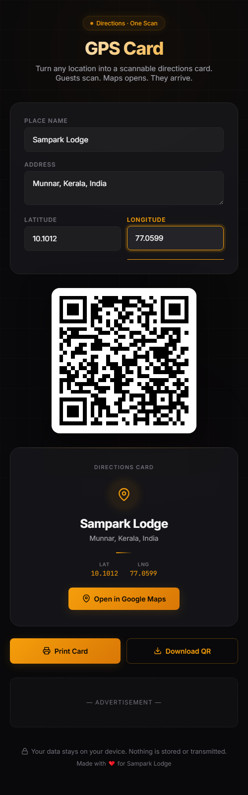

<p align="center">
  <picture>
    <source media="(prefers-color-scheme: dark)" srcset="preview.png">
    
  </picture>
</p>

<h1 align="center">GPS Card</h1>

<p align="center">
  <b>Turn any location into a scannable directions card.</b><br>
  <i>Guests scan. Maps opens. They arrive.</i>
</p>

<p align="center">
  <a href="https://sampark-lodge.github.io/gps-card/">
    
  </a>
  <a href="https://github.com/Sampark-Lodge/gps-card">
    
  </a>
  <a href="LICENSE">
    
  </a>
  <br>
  
  
  
  
</p>

<br>

---

## ✦ Overview

**GPS Card** creates a printable location card with a QR code that opens **Google Maps** — no apps, no signups, no backend. Anyone with a phone camera can scan and navigate to your location instantly.

Perfect for hotels, restaurants, event venues, shops, offices, wedding halls — anywhere guests need to find you.

<br>

## ✦ Features

| | |
|---|---|
| ✦ **📍 Google Maps QR** | QR encodes a direct Maps deep link — tap and navigate |
| ✦ **🌐 Address or Coordinates** | Enter by address, or precise lat/lng for accuracy |
| ✦ **🖨️ Print ready** | One-tap print with clean card layout for tents, signage |
| ✦ **⬇️ Download PNG** | Export QR for digital use — flyers, emails, social media |
| ✦ **🔒 100% private** | Everything runs in your browser. Zero server calls |
| ✦ **✨ Living design** | Animated amber orbs, glow effects, smooth micro-interactions |
| ✦ **📱 Fully responsive** | Works flawlessly on phone, tablet, desktop |
| ✦ **🌙 Dark mode** | Easy on the eyes, amber-accent design |

<br>

## ✦ How It Works

```
      Enter Place Name  →  Add Address  →  Set Coordinates (optional)
              │                │                      │
              └────────────────┴──────────────────────┘
                               │
                    Google Maps QR generated instantly
                               │
                    ┌──────────┴──────────┐
                    ▼                     ▼
              Print Card           Download QR

```

<p align="center">
  <em>QR encodes <code>https://maps.google.com/maps?q=...</code> — opens natively in Google Maps on iOS & Android.</em>
</p>

<br>

## ✦ Visual Design

```
┌──────────────────────────────────────────────────┐
│                    GPS Card                       │
│          Directions · One Scan                    │
│  ┌──────────────────────────────────────────────┐│
│  │  Place Name       ┌──────────────────┐      ││
│  │  Address          │  Sampark Lodge   │      ││
│  │  Latitude     Lng │  Munnar, Kerala… │      ││
│  │                   │  10.1012  77.0599│      ││
│  │                   └──────────────────┘      ││
│  │         ┌──────────────┐                    ││
│  │         │   [QR]       │                    ││
│  │         └──────────────┘                    ││
│  │                                              ││
│  │           📍 Sampark Lodge                   ││
│  │          Munnar, Kerala, India               ││
│  │        ─ ─ ─ ─ ─ ─ ─ ─ ─ ─ ─               ││
│  │        Lat  10.1012  │  Lng  77.0599        ││
│  │                                              ││
│  │     [ 🗺️ Open in Google Maps ]              ││
│  │                                              ││
│  │  [ 🖨️ Print Card ] [ ⬇️ Download QR ]      ││
│  └──────────────────────────────────────────────┘│
│        🔒 Your data stays on your device.        │
└──────────────────────────────────────────────────┘
```

### Design Tokens

| Token | Value | Preview |
|---|---|---|
| `--bg` | `#09090b` |  Near-black |
| `--surface` | `#18181b` |  Card surface |
| `--accent` | `#f59e0b` |  Amber |
| `--border` | `#27272a` |  Subtle border |
| `--text` | `#fafafa` |  White |
| `--text-secondary` | `#a1a1aa` |  Muted |

<br>

## ✦ Tech Stack

```
┌────────────────────────────────────────────────┐
│               index.html (6 KB gz)               │
│  ┌──────────┐  ┌──────────┐  ┌────────────────┐ │
│  │  HTML5   │  │  CSS3    │  │   Vanilla JS   │ │
│  │  Semanti │  │  Flexbox │  │   QR generation│ │
│  │  c       │  │  Custom  │  │   Animations   │ │
│  │  Layout  │  │  Props   │  │   Event handling│ │
│  │          │  │  + Animat│  │                │ │
│  │          │  │  ions    │  │                │ │
│  └──────────┘  └──────────┘  └────────────────┘ │
│                                                   │
│  External: qrcodejs (CDN)  •  Google Fonts (Inter)│
│  Hosting: GitHub Pages     •  AdSense             │
└───────────────────────────────────────────────────┘
```

- **Zero build tools** — no npm, no webpack, no config
- **Zero servers** — everything runs in the browser
- **Zero tracking** — no cookies, no analytics, no telemetry
- **One dependency** — `qrcodejs` from CDN

<br>

## ✦ QR Format Reference

| Input | Generated URL |
|---|---|
| Lat/Lng | `https://maps.google.com/maps?q=10.1012,77.0599` |
| Address | `https://maps.google.com/maps?q=Munnar%2C+Kerala%2C+India` |

<br>

## ✦ File Structure

```
gps-card/
├── index.html       ← Entire application (HTML + CSS + JS)
├── preview.png      ← Social preview / screenshot
├── robots.txt       ← SEO crawl rules
├── sitemap.xml      ← SEO sitemap
└── README.md        ← You are here
```

<br>

## ✦ Local Usage

```bash
git clone https://github.com/Sampark-Lodge/gps-card.git
cd gps-card
open index.html
```

Or just use it at **[https://sampark-lodge.github.io/gps-card/](https://sampark-lodge.github.io/gps-card/)** — no installation required.

<br>

## ✦ Privacy

> **Your location data never leaves this device.**

All processing happens **entirely in your browser**. The Google Maps URL is generated client-side. No data is transmitted, stored, logged, or shared.

<p align="center">
  
  
  
  
</p>

<br>

## ✦ Use Cases

- 🏨 **Hotels & lodges** — print GPS cards for guest directions
- 🍽️ **Restaurants & cafés** — laminate QR tent cards for tables
- 🎪 **Event venues & weddings** — include in invitation cards
- 🏢 **Offices & coworking** — help visitors navigate easily
- 🛍️ **Shops & stores** — add to flyers and advertisements
- 🅿️ **Parking lots** — guide guests to the entrance

<br>

---

<p align="center">
  <sub>Built with ❤️ for Sampark Lodge · Made in India 🇮🇳</sub>
  <br>
  <sub>
    <a href="https://sampark-lodge.github.io/gps-card/">Launch App</a> ·
    <a href="https://github.com/Sampark-Lodge/gps-card/issues">Report Issue</a>
  </sub>
</p>
